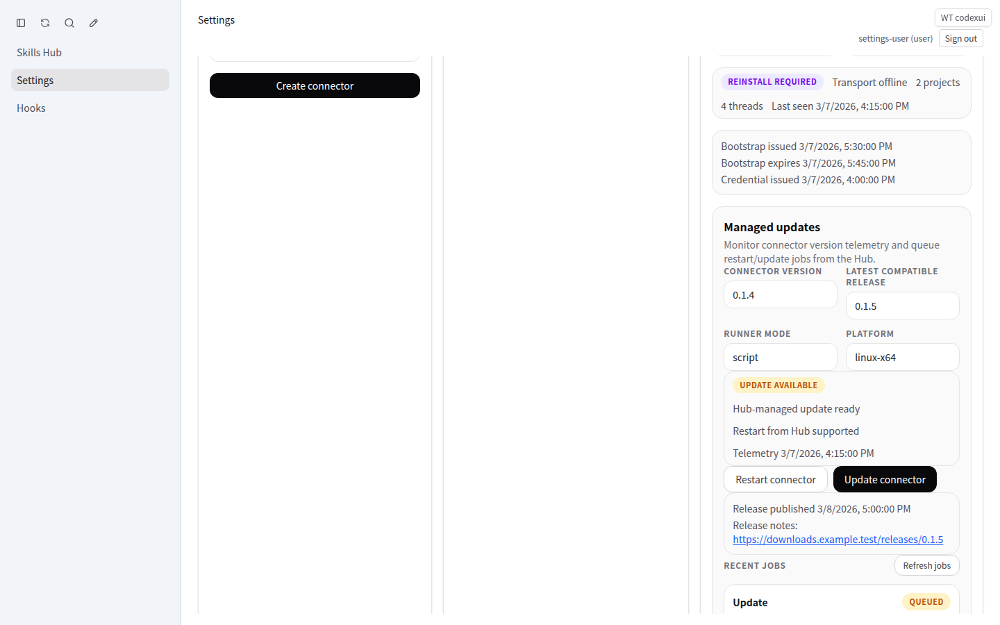
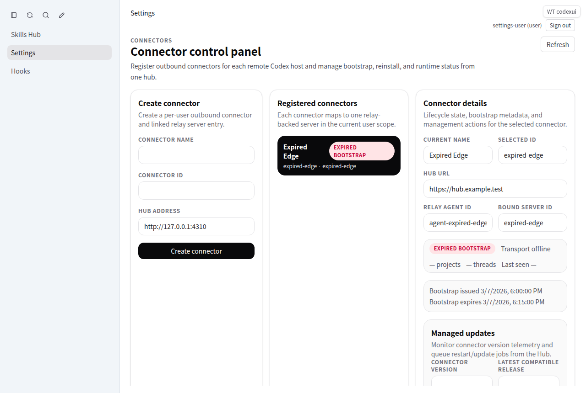

# Hub-managed connector updates report

## Scope

This rollout completes the package-managed connector update flow for Hub-controlled connectors (`script`, `systemd-user`, and `pm2-user`). The implementation covers:

1. **Connector runtime telemetry**
   - Connectors now report `connectorVersion`, `runnerMode`, `platform`, `hostname`, `updateCapable`, and `restartCapable` during bootstrap, relay connect, and job polling.
2. **Release catalog + update job API**
   - The Hub stores a release manifest in SQLite state entries.
   - Users can queue connector-scoped `update` and `restart` jobs.
   - Connectors poll `/codex-api/connector-agent/jobs/poll` and post progress to `/codex-api/connector-agent/jobs/:id/status`.
3. **Managed runtime bundle**
   - `codexui-connector install` now writes a stable managed runner bundle under `$HOME/.config/codexui-connector/`.
   - Generated helper scripts point at that stable runner instead of embedding a one-off `connect` command.
4. **Settings UI controls**
   - Settings now shows connector version telemetry, latest compatible release, update status, restart/update actions, and recent update job history.
5. **Backward-compatible auth/routing**
   - Connector-agent polling/status routes are exposed as relay-authenticated public endpoints without relaxing normal session auth.

## TDD execution summary

### Phase 1 — RED tests
Added focused RED coverage for:
- `tests/multi-server/connector-update-management.test.mjs`
- `tests/multi-server/connector-managed-updates.test.mjs`
- `tests/multi-server/connector-provisioning-package.test.mjs`

These tests initially failed on missing managed runtime exports, missing connector telemetry fields, missing update-job API routes, and install output that still used raw `connect` commands.

### Phase 2 — GREEN runtime/API
Implemented:
- `src/shared/connectorManagedRuntime.ts`
- `src/connector/managedUpdates.ts`
- `src/server/connectorUpdateStore.ts`
- `src/server/codexAppServerBridge.ts`
- `src/server/authMiddleware.ts`
- `src/connector/index.ts`

Result:
- managed update unit tests and connector update management contract tests turned green.

### Phase 3 — GREEN Settings UI
Implemented:
- `src/api/codexGateway.ts`
- `src/components/content/SettingsPanel.vue`
- `tests/playwright/settings-connectors.spec.ts`

Result:
- Settings shows update status, restart/update buttons, and job history.

## Verification

### Build
```bash
npm run build
```
Passed.

### Contract / integration tests
```bash
npm run test:multi-server
```
Passed: **53 / 53**.

Notable coverage includes:
- connector managed update staging/finalization
- connector telemetry and release manifest exposure
- user-scoped update job creation/history
- unsupported runner rejection (`409`)
- install CLI helper-script generation

### Playwright
```bash
PLAYWRIGHT_BASE_URL=http://127.0.0.1:4310 npx playwright test tests/playwright/settings-connectors.spec.ts --reporter=line
```
Passed: **2 / 2**.

## Screenshots

### Settings with managed update controls


### Expired bootstrap state


## Commits in this rollout
- `df768d1` — `Add managed connector update runtime and APIs`
- `84f6beb` — `Add connector update controls to settings`

## Notes / constraints
- This rollout intentionally targets **package-managed connectors only**.
- Container-managed connectors were explicitly removed from scope and are not updated by the Hub in this design.
- Update execution expects a compatible release manifest entry (artifact URL + SHA-256) before the Hub can queue an update job.
